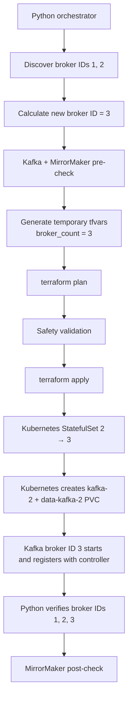

# Kafka Broker Expansion Automation

A deliberately narrow platform-engineering project that safely expands an **existing
Kubernetes-hosted Kafka cluster from two brokers to three**. Python owns Kafka-aware
orchestration and safety checks; Terraform owns the Kubernetes desired state.

This repository is an interview-ready reference implementation and lab project. It is
**not presented as production-ready software**.

## The one operation V1 supports



The Kafka broker ID and Kubernetes ordinal are intentionally different: with
`broker_node_id_base = 1`, StatefulSet pod `kafka-2` starts as Kafka broker ID `3`.

The command follows one fail-closed workflow:

1. Discover exactly Kafka broker IDs `[1, 2]`, calculate the next ID as `3`, and require
   no unavailable partitions and (by default) no under-replicated partitions.
2. Require the Kafka StatefulSet to be settled at two ready replicas.
3. Require the MirrorMaker Deployment to be fully rolled out and its target-cluster
   heartbeat topic to contain a recent message.
4. Generate an ephemeral `expansion.tfvars.json` with `broker_count=3`, run
   `terraform plan` from it, and inspect the plan's JSON representation.
5. Reject the plan unless its **only** meaningful action is an in-place update of
   `kubernetes_stateful_set_v1.kafka`, with replicas as the **only field** changing from
   2 to 3. Creates, deletes, replacements, and unrelated updates are rejected.
6. Ask for operator confirmation (unless `--yes` is supplied), then apply the exact saved
   plan that was validated.
7. Wait for pod `kafka-2`, PVC `data-kafka-2`, the three-replica StatefulSet, and exact
   broker IDs `[1, 2, 3]` in Kafka metadata.
8. Re-run the MirrorMaker rollout and heartbeat checks and emit a structured success or
   failure event.

## Why provisioning is separate from partition reassignment

Adding a broker changes cluster capacity, but Kafka does not automatically redistribute
existing partitions onto that broker. Provisioning and reassignment have different risk
profiles:

- **Provisioning** creates the broker process, identity, network endpoint, and durable
  volume, then proves the broker joined the cluster.
- **Partition reassignment** moves replicated data and can create substantial network,
  disk, and controller load. It needs its own capacity model, throttling, ISR monitoring,
  pause/resume controls, and rollback strategy.

Combining both in one opaque operation would make failures harder to reason about and
could turn a safe capacity addition into an uncontrolled data movement event. V1 stops
after broker registration and explicitly leaves reassignment to a separately designed,
operator-reviewed workflow.

## Project layout

```text
.
├── config/cluster.example.yaml        # Runtime inputs and safety thresholds
├── src/kafka_broker_expansion/
│   ├── cli.py                         # CLI and exit behavior
│   ├── config.py                      # Typed config + hard 2→3 scope guard
│   ├── kafka_checks.py                # Metadata, ISR, MM2 heartbeat checks
│   ├── kubernetes_checks.py           # StatefulSet, Deployment, Pod, PVC checks
│   ├── terraform.py                   # Plan/apply + strict JSON allow-list
│   └── workflow.py                    # Ordered orchestration
├── terraform/                         # Existing KRaft broker StatefulSet model
├── tests/                             # Safety and orchestration unit tests
└── .github/workflows/ci.yml           # Python and Terraform validation
```

## Assumptions and prerequisites

- Python 3.11+, Terraform 1.7+, and access to the target Kubernetes context.
- An existing two-broker KRaft Kafka cluster with a separate, healthy controller quorum.
- The broker StatefulSet and its services are already managed by this Terraform state.
  If adopting existing infrastructure, first align the HCL with the live resources and
  use a reviewed Terraform import process. The safety guard intentionally rejects an
  initial plan that proposes creating the cluster.
- A running MirrorMaker 2 Deployment and a heartbeat topic visible on the target cluster.
- Network access from the machine running the command to Kafka and the Kubernetes API.
- `TF_VAR_cluster_id` and the environment-specific Terraform variables set to the exact
  values used by the existing cluster.

The included Terraform is a concrete KRaft broker model, not a universal Kafka chart. In
particular, image conventions, security protocols, authentication, scheduling rules, and
storage settings must be aligned with the existing cluster before importing state.

## Setup

```bash
python -m venv .venv
source .venv/bin/activate
make install
cp config/cluster.example.yaml config/cluster.yaml
cp terraform/terraform.tfvars.example terraform/terraform.tfvars
```

Edit both copied files for the lab cluster, then initialize and validate Terraform:

```bash
export TF_VAR_cluster_id='<existing-kraft-cluster-id>'
make terraform-validate
make check
```

Run the guarded expansion:

```bash
kafka-expand --config config/cluster.yaml
```

For a non-interactive, already-reviewed run:

```bash
kafka-expand --config config/cluster.yaml --yes
```

Logs are newline-delimited JSON with stable events such as `preflight_passed`,
`terraform_plan_validated`, `new_broker_ready`, `postflight_passed`, and
`expansion_failed`.

## Safety and failure behavior

- Configuration validation hard-codes the V1 transition to exactly 2 → 3.
- Kafka and Kubernetes must agree on the starting broker count.
- The saved Terraform plan is parsed before approval and the same plan file is applied.
- A post-apply timeout or failed MirrorMaker check returns a failure and states that
  Terraform has already been applied.
- There is **no automatic rollback**. Deleting a newly joined broker or its PVC without
  understanding Kafka state is more dangerous than stopping for operator diagnosis.
- Credentials and cluster IDs are not logged or committed.

## What V1 intentionally does not do

No partition reassignment, autoscaling, UI, AI agent, multi-cluster lifecycle management,
controller changes, topic management, or automatic rollback. Those are separate problems,
not hidden stretch goals.

## Local quality checks

```bash
make lint
make test
make typecheck
make terraform-fmt
make terraform-validate
```

GitHub Actions runs linting, tests with coverage, `terraform fmt -check`, and
`terraform validate` on pushes and pull requests.

## Sensible next increments

1. Build an ephemeral Kind integration fixture with two brokers, a separate controller
   quorum, and MM2 so the full command can be exercised in CI outside the unit-test job.
2. Add TLS/SASL and Kubernetes RBAC examples without weakening the plan allow-list.
3. Design partition reassignment as a separate V2 proposal with a dry-run, movement
   budget, throttling, and explicit operator approval; do not silently bolt it onto V1.
